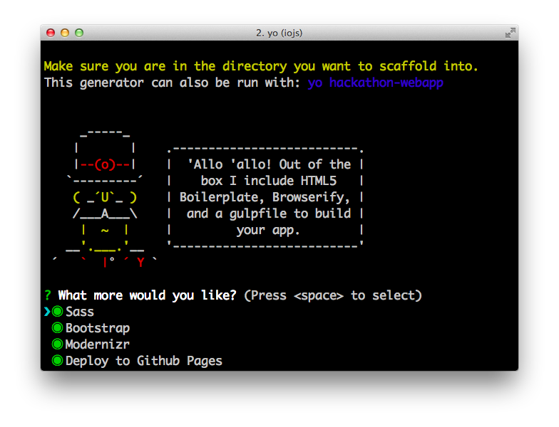

# generator-hackathon-webapp [](https://travis-ci.org/timotius02/generator-hackathon-webapp)

> [Yeoman](http://yeoman.io) generator for quickly building modern web apps using Gulp, Browserify, and Babel



###Disclaimer

*This generator is meant for quickly iterating on projects and not suitable for production level environment.*

## What's inside?

Bundled:

* [Gulp](http://gulpjs.com/)
* [Bower](http://bower.io/)
* [Browserify](http://browserify.org/) with Watchify support 
* livereload via [BrowserSync](http://www.browsersync.io/)
* Sourcemaps for styles and scripts
* ES6 & React Support via [Babel](https://babeljs.io/)

Optional: 

* Sass Compilation via [Libsass](http://libsass.org/)
* [Twitter Bootstrap](http://getbootstrap.com/) - Sass/Css version
* [Modernizr](http://modernizr.com/)
* [jQuery](https://jquery.com/)
* Quick deploy to [Github Pages](https://pages.github.com/)


## Requirements

* node.js >= 0.12
* Node-Sass >= 3.2 for Sass compilation

If you need to install node-sass
```
$ npm install -g node-sass
```

## Getting Started

```
$ npm install -g yo                                # Install Yeoman (if you don't have it yet)...
$ npm install -g generator-hackathon-webapp   	   # ...then install this generator...
$ yo generator-hackathon-webapp                    # ...and run it.
```

## Gulp Tasks

- Run `gulp serve` to preview and watch for changes
- Run `gulp` to build your webapp before deploying
- Run `gulp serve:dist` to preview the deploy build

## License

MIT